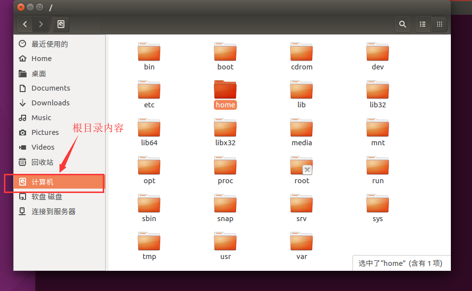
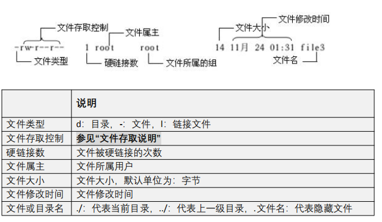
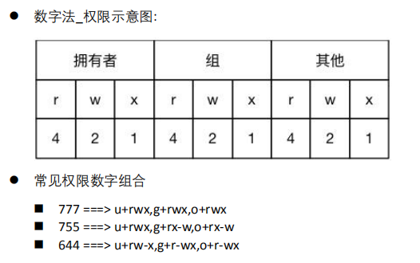

# 1.图形界面下查看根目录内容



# 2.linux下的常用快捷方式

- 上下键,快速调出历史执行过的命令
- tab键,自动补齐

# 3.linux查看帮助

- 命令 --help  
  - 简化版帮助信息
- man 命令
  - 空格,下翻一页
  - b,上翻一页
  - q,退出

# 4.pwd

- 查看当前所在目录

# 5.ls显示目录内容

- linux所有的文件和目录区分大小写
- 文件或者目录名以.开头,代表是一个隐藏文件或者目录
- ./当前目录
- ../上一级目录
- ls [目录名]
  - ls后面没有目录名,代表显示当前目录内容
  - ls 后面有目录名,代表显示指定目录内容

```cmd
#显示当前目录内容
ls 
ls ./
#显示当前目录的子目录内容
ls abc
ls ./abc
#显示根目录内容
ls /
#显示根目录下的bin目录内容
ls /bin
#显示上级目录内容
ls ..
```

- ls的常用参数
  - -a显示所有文件,包括隐藏文件
  - -l,显示文件或者目录的详细信息
  - -h是和l配合使用的,显示文件大小的时候,用人性化方式显示

```cmd
#显示所有文件
ls -a
#显示详细信息
ls -l
#显示详细信息,文件大小用人性化方式显示
ls -hl
#显示所有文件的详细信息
ls -al
```

- ls -l返回结果说明



- 第一位:-代表文件,d代表目录
- 第二位开始是文件存取控制
  - 一共9个位,每三位是一组,分别是三组,文件拥有者,文件所属组,和其他用户
  - 每三位又有rwx
    - r:可读
    - w:可写
    - x可执行
- 用户和组的概念
  - 每个目录或者文件一定会属于一个用户和一个组
  - 用户名和组名可以相同

# 6.ls结合通配符

- *,代表任意多个字符

```cmd
#查看以a结尾的文件,或者目录的内容
ls *a
#查看以a开头的文件或者目录的内容
ls a*
#只要名字中有a就显示
ls *a*
```

- ?代表任意一个字符

```cmd
#a开头,后面任意一个字符
ls a?
#开始有一个任意字符,后面a结尾
ls ?a
#查看名字只有两个字符的
ls ??
```

- []代表范围

```cmd
# a或者b或者c开头,后面任意
ls [a,b,c]*
#a到f任意的一个开头,后面任意
ls [a-f]*
#只要名字中有a到f中的任意一个字符即可
ls *[a-f]*
```

# 7.chmod

- 修改文件读取权限
- u = user 文件所属用户
- g = group 文件所属的组
- o = other 其他用户
- a = all 所有用户
- +, 赋权
- -,去权
- =,后面有的就会赋权,没有的就去权

```cmd
#给文件所有者给予可读权
chmod u+r a.txt
#给文件所有者去掉可读权
chmod u-r a.txt
#所有用户添加所有权限
chmod a+rwx a.txt
#只保留r,wx去掉
chmod o=r a.txt
```



```cmd
#所有用户所有权限
chmod 777 a.txt
#所有用户只保留x权限
chmod 111 a,txt
```

# 8.cd切换目录

- cd 目录名
- cd ..
  - 返回上级目录
- cd
  - 回到用户的主目录
- cd ~
  - 回到用户主目录
- cd -
  - 回到切换之前的目录
- 绝对路径和相对路径
  - 绝对路径:从根目录开始的
  - 相对路径:从当前目录开始的

```cmd
#进入当前目录下的子目录abc
cd abc
#进入根目录下的abc目录
cd /abc
# 回到用户的主目录
cd
#返回上级目录的上级目录
cd ../..
#回到切换之前的目录
cd -
```

# 9.touch

- 创建空文件或者更改文件最后修改日期
- touch 文件或者目录名
  - 如果要更改一个目录的最后修改时间,touch后面的目录名一定要存在

```cmd
touch b.txt
```


# 10.mkdir创建目录

- mkdir 目录名
- mkdir -p 目录/目录
  - 创建有嵌套关系的多级目录

```cmd
#创建一个目录aaa
mkdir aaa
#创建一个有嵌套关系的多级目录a/b/c
mkdir -p a/b/c
```

# 11.rm删除文件或者目录

- rm 文件
- rm -r 目录
- 当文件或者目录不存在的时候,rm会报错
  - -f,如果目标不存在,也不报错

```cmd
#删除abc目录,即使abc目录不存在,也不报错
rm -rf abc
```

# 12.cp和mv

- cp文件拷贝
  - cp 原文件 目标文件
  - -r拷贝目录
  - -i当目标文件已经存在,给用户是否覆盖的提示
- mv文件移动
- mv和cp参数基本一致
- mv和cp的区别是,cp之后,原文件还存在,mv之后,原文件不存在了

```cmd
#把当前目录下的a.txt拷贝到abc目录下
cp a.txt abc/a.txt
#把abc目录下的a.txt拷贝到当前目录下
cp abc/a.txt a.txt
```

# 13.cat查看文件内容

- cat 文件名

```cmd
#查看a.txt内容
cat a.txt
#/proc目录下面放了一些和系统信息相关文件
cd /proc
#查看linux版本
cat version
#查看cpu信息
cat cpuinfo
```

# 14.more分屏查看文件内容

- more 文件名
  - 按空格向下翻一页
  - b回看一页
  - q退出

```cmd
#在/proc目录下显示meminfo
more meminfo
```


# 15.grep在指定文件中查找指定的字符串

- grep "字符串" 文件名

```cmd
#在meminfo文件中查找是否有字符s的行
grep "s" meminfo
```

- -n显示行号
- -v查找不包含指定内容的行
- -i忽略大小写

```cmd
grep -n "s" meminfo
grep -ni "s" meminfo
```

- grep的模式查找
  - ^字符串
    - 查找指定字符开头的行
  - 字符串$
    - 查找指定字符结尾的行
  - ^字符串.*字符串$
    - 查找指定字符开头,指定字符结尾的行

```cmd
#找以a开头的行
grep "^a" meminfo
#找以a结尾的行
grep "a$" meminfo
#找以a开头以a结尾的行
grep "^a.*a$" meminfo
```

# 16.echo回显字符串

- echo 字符串
- 把echo后面的字符串回显到屏幕

```cmd
echo hello
```

# 17.clear清屏

- 类似于dos cls

```cmd
clear
```

# 18.输出重定向

- 命名 参数 > 文件名
  - 把一个命令指定的结果不输出到屏幕,而是重定向到一个指定的文件里
  - 如果文件不存在,就创建新文件,如果文件存在就覆盖文件

```cmd
#把ls -l命令执行结果放到a.txt里
ls -l > a.txt
#把echo命令执行的结果放入a.txt
echo aaa > a.txt
```

- 命名 参数 > >文件名

- 把一个命令指定的结果不输出到屏幕,而是重定向到一个指定的文件里
- 如果文件不存在,就创建新文件,如果文件存在就文件后面追加新内容

# 19.管道符|

- 管道的作用就是把一个命令的输出做为另一个命令的输入
- 命令1 | 命令2
  - 命令1的输出结果为做为命令2的输入数据

```cmd
#把ls -al的结果做为more的输入,结果就是可以间接的实现ls的分屏显示
ls -al | more
```

- ls -al结果只显示目录

```cmd
ls -al | grep "^d"
```


# 20.cat结合重定向可以快速的合并文件

- cat 文件1 文件2 文件3 > 文件4
  - 把文件1和文件2,文件3内容合并到文件4里面

```cmd
#把a.txt和b.txt内容合并到c.txt里面
cat a.txt b.txt > c.txt
```


# 21.find查找指定文件

- find 开始目录 -name 文件名

```cmd
#从当前目录开始查找所有子目录,是否存在a.txt文件
find ./ -name a.txt
#从根目录开始查找所有子目录,是否存在a.txt文件
find / -name a.txt
```

# 22.ln创建链接文件

- 创建软链接
  - ln -s 原文件 链接文件

```cmd
#给a.txt创建一个软链接a
ln -s a.txt a
```

- 创建硬链接
  - ln 原文件 硬链接文件

```cmd
#给a.txt创建一个硬链接文件b
ln a.txt b
```

- 软链接文件,用ls -l显示的时候,第一行标识是l
- 硬链接文件,用ls -l显示文件硬链接数会增加
- 软链接与硬链接区别
  - 软链接不占用磁盘空间,硬链接会占用磁盘空间
  - 当原文件不存在,软链接也没有意义了,但硬链接还可以使用

# 23.linux权限的含义

- r
  - 对于文件来,没有r权限,文件就是不可读的
  - 对于目录来讲,没有r,就不能用ls看目录的内容了
- w
  - 对于文件,没有w文件内容只读
  - 对目录,没有w,不可以在这个目录下创建新的文件
- x
  - 对于文件,如果这个文件是个可执行的程序,没有x,就不能执行了
  - 对于目录,没有x,不能用cd进入这个目录

