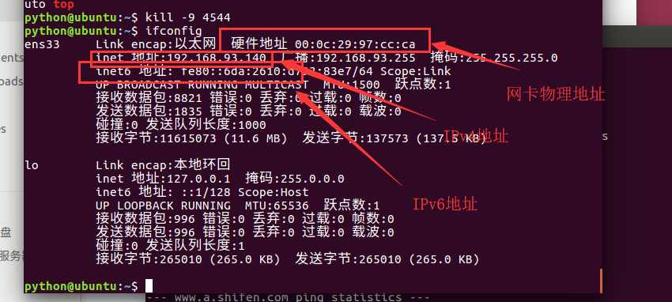
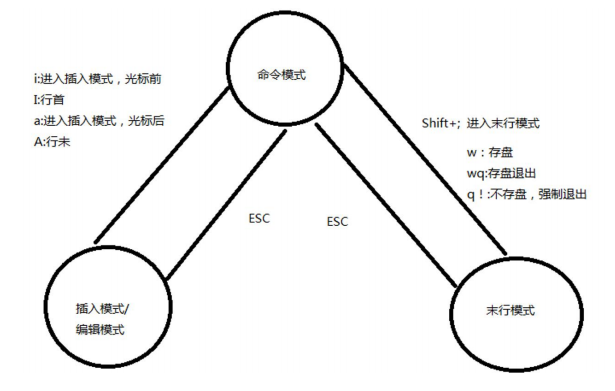

# 1.gzip压缩和解压文件

- gzip 文件名    压缩指定文件

```cmd
gzip a.txt
# 把a.txt压缩为a.txt.gz,同时a.txt文件不存在了
```

- gzip -d 文件名

```cmd
gzip -d a.txt.gz
# 把a.txt.gz解压,解压完之后生成a.txt,a.txt.gz就不存在了
```

# 2.zip压缩和解压文件

- zip 文件名.zip 源文件

```cmd
zip a.zip a.txt
把a.txt压缩为a.zip ,压缩完成之后a.txt还存在
```

- unzip 文件名

```cmd
unzip a.zip
把a.zip解压,解压完成之后,a.zip还存在
```

# 3.tar打包和解包文件或目录

- tar -cvf 打包文件名 源文件

```cmd
tar -cvf abc.tar abc
#把abc目录打包为一个文件abc.tar
tar -tvf abc.tar
#查看abc.tar文件的内容
tar -xvf abc.tar
#将abc.tar还原
```

# 4.tar与gzip通过-z实现一步操作

- tar -zcvf 文件名 源文件

```cmd
tar -zcvf abc.tar.gz abc
# 把abc打包之后同时用gzip压缩
tar -zxvf abc.tar.gz
# 把abc.tar.gz用gzip解压之后用tar解包
```

# 5.df显示磁盘空间

- df -h用人性化的方式显示大小

# 6.ps显示系统进程

- ps -aux或者ps aux
  - 显示系统中所有的进程,并且显示进程的详细信息

# 7.top动态查看进程信息

- top
- PID 每一个执行的进程都有一个唯一的不重复编号PID
- CPU占用
- MEM占用

# 8.kill杀死进程

- kill PID
- kill -9 PID ,当用kill PID杀不掉,那么用-9参数

```cmd
# 在图形界面下,启动了gedit程序,用kill杀掉
ps aux | grep 'gedit'
kill gedit的PID
```

# 9.ping测试目标主机是否网络联通

- ping ip或者域名

# 10.ifconfig查看网卡信息

- ifconfig



# 11.su切换用户

- su - 用户名
- 需要输入密码
  - 注意:在linux输入密码的时候不回显
- 退回su之前的用户
  - exit

- su - 用户名 su 用户名
  - 加了-切换用户,同时改变当前目录为用户的主目录
  - 不加-,切换用户,但不改变当前目录
- 如果要切换的是root,su后面可以省略用户名root
  - su -等同于su - root
  - su 等同于su root
- 其他用户切换root用户需要输入密码
- root切换其他用户不用密码

# 12.useradd添加用户

- -d 指定添加用户的主目录
- -m 当-d参数指定的目录不存在,就自动创建这个目录

```cmd
useradd -d /home/abc abc -m
#添加一个用户名叫abc,主目录是/home/abc目录,当abc目录不存在,自动创建
```

# 13.passwd修改用户密码

- passwd 用户名
- root可以改其他用户的密码
- 其他用户只能修改自己的密码

# 14.增加用户和修改用户的注意

- 只有root用户才能添加新用户
- 普通用户只能修改自己的密码

# 15.userdel删除用户

- -f 当用户已经登录了,也强制删除
- -r删除用户的同时删除其对应的主目录

```cmd
userdel -r abc
删除用户abc,同时删除abc对应的主目录
```

# 16.whoami查看当前登录用户名

- whoami

# 17vi的使用

- 首次使用vi的演示

```txt
用vi新建一个文件,abc.txt,在文件里写hello world,保存退出
第一步:用vi新建一个名为abc.txt的文件
vi abc.txt
第二步:进入vi界面后,按i键
hello world
第三步:按ESC键
第四步:按:号
第五步:按wq回车
完成用vi创建文件
```




- 首次进入vi进入命令模式
- 命令模式下输入i.进入输入模式
- 输入模式下ESC回到命令模式
- 命令模式下:进入末行模式
- 在末行模式下按ESC返回命令模式
- 不论在什么模式下,按ESC总是回到命令模式

## vi的三种启动方式

- vi 新文件
  - 创建一个新文件
- vi 已有文件
  - 打开一个已经存在的文件
- vi
  - 退出vi的时候w 后面要加一个文件名,代表保存文件

## vi的三种退出方式

- 在命令模式下按:, 回到末行模式
- 在末行模式下
- wq   ---保存退出
- q!    ----不保存退出
- q    -----如果文件没有修改,用q退出,如果文件内容已经变化,不能用q退出

## 用vi编辑一个文件,让这个文件可执行

- 第一步,用vi创建了一个文件名字叫a
- 在a文件里输入一个linux命令
  - cat /proc/cpuinfo
- 保存退出vi后,给a文件添加可执行的权限
  - chmod a+x a
- 执行a
  - ./a
  - 原因是linux不会在当前目录下查找可执行文件
- 修改linux的配置文件,使其可以在当前目录下查找可执行文件
  - 回到用户的主目录
    - cd
  - 在主目录下用vi编辑一个文件.profile
    - vi .profile
  - 在.profile文件最后添加一行
    - export PATH=$PATH:.
  - 保存退出
  - 让修改立刻生效
    - source .profile
  - 生效之后就可以执行a,来执行了


## vi命令模式下的常用命令

- 从命令模式进入输入模式
  - i在光标当前位置插入
  - a在光标后面插入
  - I在光标所在行的行首插入
  - A在光标所在行的行尾插入
  - o在光标所在行的下面开启一个新行插入
  - O在光标所在行的上面开启一个新行插入

- 从命令模式进入末行模式
  - :

- 删除命令
  - x,删除光标所在位置的字符
  - dd,删除光标所在行
  - ndd,n是一个数字,代表删除指定数量的行

- 撤销与反撤销命令
  - u撤销
  - ctrl+r 反撤销
- 复制和粘贴命令
  - yy复制光标所在的一行
  - nyy复制光标所在的n行
  - p从光标所在位置下面开辟新行并复制

- 查找命令
  - /字符串
  - 查找指定的字符串
    - n查找下一个
    - N查找上一个
  - 定位到指定的行
    - nG
      - 20G  ---跳转到第20行
      - 1G    ---回到第一行
      - G      ----到最后一行

- 末行模式命令
  - w ---保存文件,不退出vi
  - w 文件名 另存为
  - wq保存退出
  - q 退出,如果文件内容已经修改,那么q会提示错误
  - q!,不保存退出