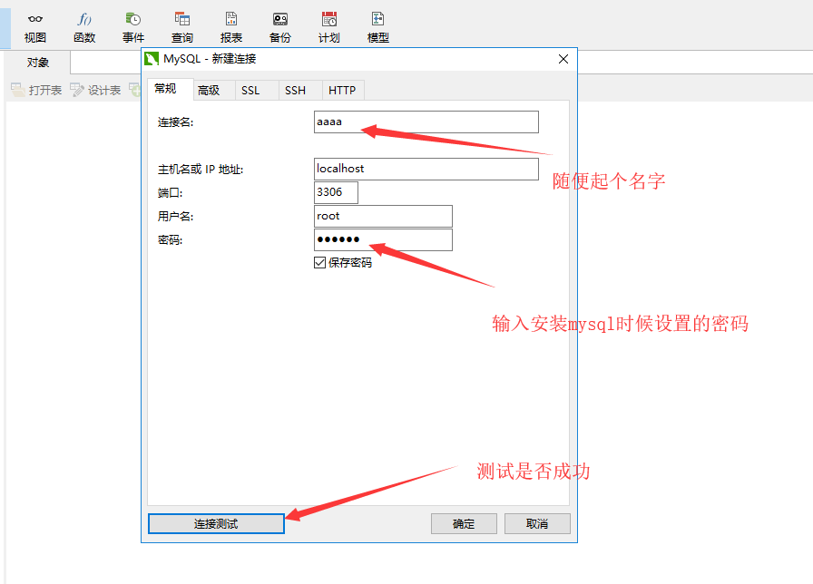
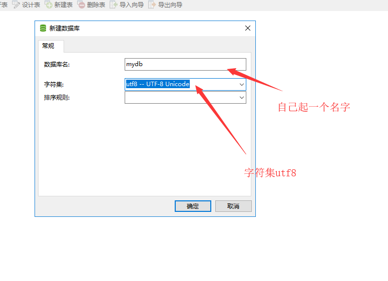
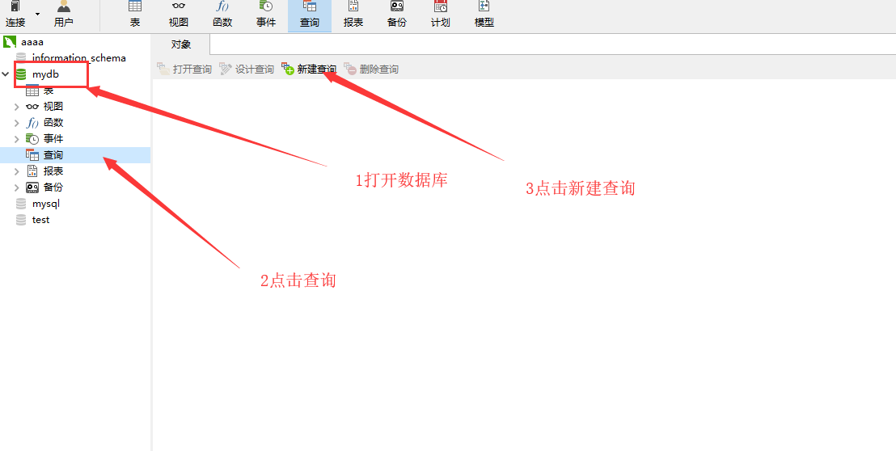
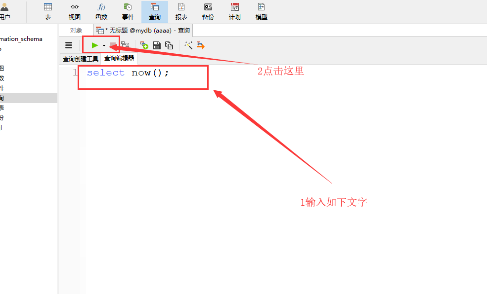
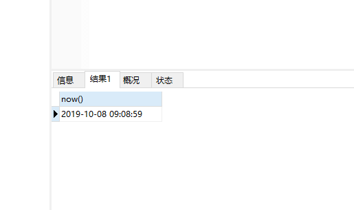
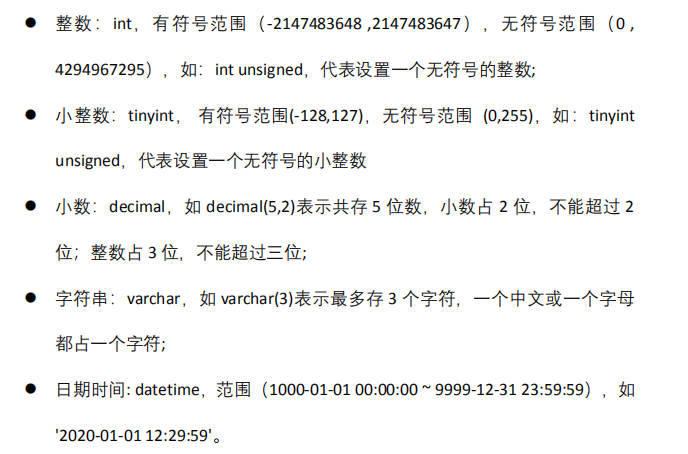
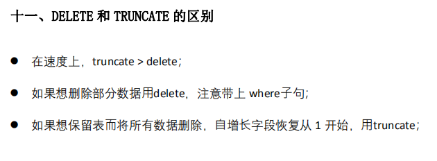
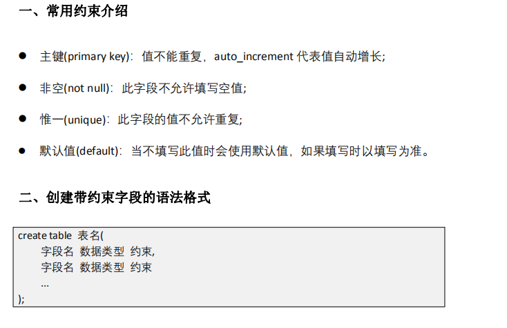

# 1.navicat基本使用

- 连接到mysql



- 连接到mysql之后,首先要创建数据库
- 用鼠标右键选择新建数据库




- 打开数据库,新建查询





- 看到如下结果,代表navicat连接mysql设置成功



# 2.sql语言中的注释

- -- 行注释
- /*  注释内容 */

# 3.mysql的常用数据类型



# 4.数据库中的元素

- 数据库-----database
- 表----table
- 字段(列)---field
- 记录(行)---record

# 5.创建表

- 语法:create table 表名(字段名 字段类型, 字段名 字段类型)

```sql
-- 例 1：创建表 a，字段要求:name(姓名)，数据类型：varchar(字符串)，长度为 10
CREATE TABLE a(name varchar(10));
```


- 创建两个字段的表

```sql
-- 例 2：创建表 b，字段要求: name(姓名),数据类型为 varchar(字符串)，长度为 10； 
-- height(身高)，数据类型为 decimal(小数），一共 5 位, 其中 3 位整数，2 位 小数。
CREATE TABLE b(
	name varchar(10),
	height DECIMAL(5, 2)
);
```

- 创建三个字段的表

```sql
-- 例 3：创建表 c，字段要求如下：
-- id：数据类型为 int (整数)； 
-- name 姓名：数据类型为 varchar(字符串)长度为 20， 
-- age 年龄：数据类型为 tinyint unsigned（无符号小整数）；
CREATE TABLE c(
	id int,
	name VARCHAR(20),
	age TINYINT UNSIGNED
);
```

# 6.插入数据

- 语法 : insert into 表名 values (值, 值,值);

```sql
-- 往表c插入一条记录
INSERT into c VALUES (0, '张飞', 30);
```

- 指定字段插入,语法:insert into 表名 (字段名, 字段名) values (值, 值);

```sql
-- 例 2：表 c 插入一条记录，只设置 id 和姓名 name
INSERT into c (id, name) values (3, '曹操');
```


```sql
-- 例 2：表 c 插入一条记录，只设置 id 和姓名 age
INSERT into c (id, age) values (4, 100);
```

# 7.插入多条记录

- 多条insert语句,用分号隔开

```sql
-- 例 3：表 c 插入三条记录，写三条 insert 语句, 语句之间用分号隔开
INSERT into c values (5, '周瑜', 50);
insert into c (id, name) values (6, '鲁肃');
INSERT into c (name) values ('诸葛亮');
```

- 一条insert插入多条记录
- 语法:insert into 表名 values (值,值),(值, 值),(值,值);

```sql
-- 例 4：表 c 插入多条记录，用一条 insert 语句, 数据之间用逗号隔开
insert into c values (10, '张三', 10),
(11, '李四', 20),
(12, '王五', 30);
```

- 一条insert指定字段插入多条记录
- 语法:insert into 表名 (字段名, 字段名) values (值, 值), (值, 值), (值, 值)

```sql
-- 例 4：表 c 插入多条记录，用一条 insert 语句, 数据之间用逗号隔开
insert into c (id, name) values (13, '光绪'),
(14, '康熙'),
(15, '雍正');
```

# 8.select查询表

## 查询所有字段

- 语法: select * from 表名;

- 查询表的所有字段

```cmd
-- 查询表c的所有字段
select * from c;
```

## 指定字段名查询

- 语法:select 字段名, 字段名 from 表名;

```sql
-- 查询表c的id字段
select id from c;
-- 查询表c的id和age字段
select id, age from c;
-- 查询表c的所有字段,但顺序自定义
select name, id, age from c;
```

# 9.update修改数据

- 语法:update 表名 set 字段=值, 字段=值 where 条件
  - 如果没有where 条件代表修改表中所有的记录

```sql
-- 例 1：修改表 c，所有人的年龄(age 字段)改为 50
update c set age = 50;
```

- 带有条件的update语句

```sql
-- 例 2：修改表 c，
-- id 为 3 的记录，
-- 姓名(name 字段)改为 ‘狄仁杰‘，年龄(age 字段)改为 20

update c set name = '狄仁杰', age = 20 where id = 3;
```

- 另外的例子

```sql
-- 修改name为刘备的记录为李白
update c set name = '李白' where name = '刘备';
```

```sql
-- id大于10的记录,长一岁
update c set age = age + 1 where id > 10;
```

# 10.delete删除记录

- 语法:'delete from 表名 where 条件'

```sql
-- 例 1：删除表 c 中 id 为 6 的记录
DELETE from c where id = 6;
```


```sql
-- 例 1：删除表 c 中 name 为 诸葛亮 的记录
DELETE from c where name = '诸葛亮';

-- 删除年龄大于50的记录
DELETE from c where age > 50;

-- 删除id小于3的记录
delete from c where id < 3;

-- 删除所有记录
DELETE from c;
```

# 11.truncate table删除表的数据

- truncate table 表名

```sql
-- 删除表c中所有的记录
truncate table c;
```



# 12.小结

- 增
  - insert
- 删
  - delete
- 改
  - update
- 查
  - select

# 13.删除表

- 语法一: drop table 表名

```sql
-- 删除表a
drop table a;
```

- 语法二: drop table if exists 表名

```sql
-- 如果表a存在,就删除表a,如果不存在,什么也不做
DROP table if EXISTS a;

-- 如果表b存在,就删除表b,如果不存在,什么也不做
DROP table if EXISTS b;
```


# 14.字段的约束



# 15.主键

- 主键的值不能重复
- 自增长,auto_increment
  - 值会系统自动维护,自动增长

```sql
-- 例 1：创建表 d，字段要求如下： 
-- id ： 数 据 类 型 为 
-- int unsigned( 无 符 号 整 数 ) ） ,primary key( 主键),auto_increment(自增长)； 
-- name 姓名：数据类型为 varchar(字符串)长度为 10; 
-- age 年龄：数据类型为 int（整数）；
create TABLE d (
id int UNSIGNED PRIMARY key auto_increment,
name varchar(10),
age int);

INSERT into d (name, age) values ('张飞', 30);

-- 插入的时候指定了id的值
INSERT into d (id, name, age) values (6, '曹操', 30);
-- 不指定id的值
INSERT into d (name, age) values ('周瑜', 30);
select * from d;
```

```sql
-- 如果不指定字段,主键自增长字段的值可以用占位符,0或者null
INSERT into d VALUES (0, '康熙', 30);
INSERT into d VALUES (NULL, '溥仪', 50);
```

# 16.非空

- 非空not null
  - 这个字段必须有值,如果没有值,insert插入会失败

```sql
-- 例 1：创建表 e，字段要求如下： 
-- id：数据类型为 int unsigned (无符号整数)；
--  name 姓名：数据类型为 varchar(字符串)长度为 10,not null(非空)， 
-- age 年龄：数据类型为 int（整数）；

CREATE table e (
id int UNSIGNED,
name varchar(10) not null,
age int);

insert into e values (1, '张三', 20);
insert into e (id, age) values (1, 20);
select * from e;
```


# 17.唯一

- 唯一unique
  - 字段的约束为唯一,表示字段的值不能重复

```sql
-- 例 1：创建表 f，字段要求如下： 
-- id：数据类型为 int (整数)； 
-- name 姓名：数据类型为 varchar(字符串)长度为 10,unique(唯一); 
-- age 年龄：数据类型为 int（整数）；
CREATE TABLE f (
id int,
name varchar(10) UNIQUE,
age int);

insert into f VALUES (1, '张三', 20);
insert into f VALUES (2, '李四', 20);
select * from f;
```

# 18.默认值

- default 值
- 当一个字段有默认值约束,插入数据时,如果指定了值,那么默认值无效,如果没有指定值,会使用默认值

```sql
-- 例 1：创建表 g，
-- 字段要求如下： 
-- id：数据类型为 int (整数)； 
-- name 姓名：数据类型为 varchar(字符串)长度为 10; 
-- age 年龄：数据类型为 int（整数）,default(默认值)30；
CREATE TABLE g(
id int,
name varchar(10),
age int DEFAULT 30);
insert into g values (1, '张三', 20);
-- 插入的时候不指定age的值
insert into g (id, name) values (2, '李四');

select * from g;
```

