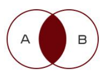

# 1连接查询

- 内连接
  - 把两张表相同的地方查询出来



- 左连接
  - 包括了内连接,同时还查询左表特有的内容


- 右连接
  - 包括了内连接,同时还查询右表特有的内容


# 2.内连接

- 语法:
  - select * from 表1 inner join 表2 on 表1.字段 = 表2.字段
  - 内连接最重要的是,找对两张表要关联的字段

```sql
SELECT * from a INNER JOIN b on a.id = b.id;
```


- students表和scores内连接查询结果

```sql
SELECT * from students INNER JOIN scores on students.studentNo = scores.studentNo;
```


- 隐式内连接语法
  - 语法:select * from 表1,表2 where 两个表的连接条件

```sql
-- 隐式内连接
SELECT * from students, scores where students.studentNo = scores.studentNo;
```

- 内连接查询,显示指定的字段

```sql
-- students表与socres内连接,只显示name 课程号 成绩
SELECT name, courseNo, score from students
INNER JOIN scores on students.studentNo = scores.studentNo;
```


- 表的别名在查询中的使用

```sql
SELECT name 姓名, courseNo 课程编号, score 成绩 from students st
INNER JOIN scores sc on st.studentNo = sc.studentNo;
```

- 课堂练习答案

```sql
-- 练习 1: 查询成绩表信息，同时显示成绩对应的课程名称
SELECT * from scores s INNER JOIN courses c on s.courseNo = c.courseNo;
```

- 带有where的内连接
  - 语法select * from 表1 inner join 表2 on 表1.字段 = 表2.字段 where 条件

```sql
-- 例 5：查询王昭君的信息，要求只显示姓名、课程号、成绩
select name, courseNo, score from students s1 
INNER JOIN scores s2 on s1.studentNo = s2.studentNo
where s1.name = '王昭君';
```

- 带有and的where条件

```sql
-- 例 6：查询姓名为’王昭君’,并且成绩小于 90 的信息，要求只显示姓名、成绩
select name, score from students s1 
INNER JOIN scores s2 on s1.studentNo = s2.studentNo
where s1.name = '王昭君' and s2.score < 90;
```

- 多表内连接

```sql
-- 例 7：查询学生信息和成绩以及成绩对应的课程名称
SELECT * from students inner join scores on students.studentNo = scores.studentNo
inner join courses on scores.courseNo = courses.courseNo;
```


# 写SQL三步法

- 搭框架
  - 基本的select语句框架搭建起来,如果有多表,把相应的多表也联合进来
- 看条件
  - 决定where后面的具体条件
- 显示的字段
  - select后面到底要显示什么字段

```sql
-- 练习 2：查询所有学生的’linux’课程成绩，要求只显示姓名、成绩、课程名
-- 第一步:搭框架
-- SELECT * from students INNER JOIN scores 
-- on students.studentNo = scores.studentNo
-- INNER JOIN courses on scores.courseNo = courses.courseNo;
-- 第二步:看条件
-- SELECT * from students INNER JOIN scores 
-- on students.studentNo = scores.studentNo
-- INNER JOIN courses on scores.courseNo = courses.courseNo
-- where courseName = 'linux';
-- 第三步:返回字段名
SELECT name, score, courseName from students INNER JOIN scores 
on students.studentNo = scores.studentNo
INNER JOIN courses on scores.courseNo = courses.courseNo
where courseName = 'linux';
```

- 带有order by的联合查询

```sql
-- 例 8：查询成绩最高的男生信息，要求显示姓名、课程名、成绩
SELECT name, score, courseName from students INNER JOIN scores 
on students.studentNo = scores.studentNo
INNER JOIN courses on scores.courseNo = courses.courseNo
where sex = '男'
order by score desc LIMIT 1;
```

# 3.左连接

- 语法
  - select * from 表1 left join 表2 on 表1.字段 = 表2.字段

```sql
-- 例 1：查询所有学生的信息以及成绩，包括没有成绩的学生
SELECT * from students left JOIN scores ON
students.studentNo = scores.studentNo;
```

# 4.右连接

- 语法
  - select * from 表1 right join 表2 on 表1.字段 = 表2.字段

```sql
-- 例 1：查询所有课程的信息，包括没有成绩的课程
SELECT * from scores RIGHT JOIN courses ON
scores.courseNo = courses.courseNo;
```

# 5.多表联合查询,同名字段的处理方式

- 如果一条select要用到多个表,表中有同名字段.就需要 表名.字段名 加以区分

```sql
select students.studentNo from students INNER JOIN scores ON
students.studentNo = scores.studentNo;
```

# 6.自关联

```sql
-- 查询一共有多少个省
SELECT count(*) from areas where pid is null;
-- 查询有多少市
SELECT count(*) from areas where pid is not null;
```

- 自关联,是同一张表做连接查询,
- 自关联下,一定找到同一张表可关联的不同字段

```sql
-- 例 2：查询广东省的所有城市
SELECT * from areas a1 INNER JOIN areas a2
on a1.id = a2.pid
WHERE a1.name = '广东省';
```

# 7.子查询

- 子查询是嵌套到主查询里面的
- 子查询做为主查询的数据源或者条件
- 子查询是独立可以单独运行的查询语句
- 主查询不能独立独立运行,依赖子查询的结果

```sql
-- 例 1：查询大于平均年龄的学生记录
-- SELECT avg(age) from students;
-- 
-- select * from students where age > 30.1667;

-- 用子查询实现
select * from students where age > (SELECT avg(age) from students);
```

- 标量子查询------子查询返回结果只有一行,一列

```sql
-- 例 2：查询 30 岁的学生的成绩
-- 1,查询30岁学生的studentNO
-- select studentNo from students where age = 30;
-- 
-- SELECT * from scores where studentNo in ('001', '003', '011');

-- 用子查询实现
SELECT * from scores where studentNo in 
(select studentNo from students where age = 30);

```

- 列子查询------子查询返回一列多行

```sql
-- 例 3：用子查询，查询所有女生的信息和成绩
-- 用内连接实现
SELECT * from students INNER JOIN scores ON
students.studentNo = scores.studentNo
where sex = '女';
-- 用子查询实现
select * from (SELECT * from students where sex = '女') stu
INNER JOIN scores sc on stu.studentNo = sc.studentNo;
```

- 表级子查询------子查询返回结果为多行,多列


- 课件提问问题及答案

```sql
-- 查询各个年龄段学生的数量,按照数量从大到小排序
select age, count(*) from students GROUP BY age ORDER BY count(*) desc;

-- 查找年龄大于等于25,小于等于30的男同学
select * from students where (age BETWEEN 25 and 30) and sex = '男';

-- 显示2班和3班的女同学
SELECT * from students where sex = '女' and class in ('2班', '3班');

-- 显示所有有效的card学生记录,null和''都是无效的
SELECT * FROM students where card is not null and card != '';


-- 查找老家不在河北和北京的同学的age总和
SELECT sum(age) from students where hometown <> '北京' and hometown <> '河北'; 
SELECT sum(age) from students where not hometown in ('北京', '河北');

-- 查找不姓'白'的同学
SELECT * from students where not name like '白%';

-- 查询每个班有分别多少同学
SELECT class, count(*) from students GROUP BY class;

-- 这个sql能不能显示年龄最大的同学的姓名
select name,max(age) from students;

-- 显示年龄最大的同学的姓名
SELECT name from students order by age desc limit 1;
SELECT name from students where age = (select max(age) from students);

-- 查询年龄最大的女同学和年龄最小的女同学差多少岁
SELECT max(age) -  min(age) from students where sex = '女';

-- 分别求男女同学的平均年龄
select sex,avg(age) from students GROUP BY sex;

-- 只显示班级人数为3个同学的班级名称
SELECT class from students GROUP BY class HAVING count(*) = 3; 

--  查询姓名只有2个字的女同学的数量
SELECT count(*) from students where sex = '女' and name like '__';

-- 查询年龄大于25,老家不在河北的男同学
SELECT * from students where age > 25 and hometown != '河北' and sex = '男' ;

-- 查询1班加3班所有同学的年龄总和
SELECT sum(age) from students where class = '1班' or class = '3班';

```

